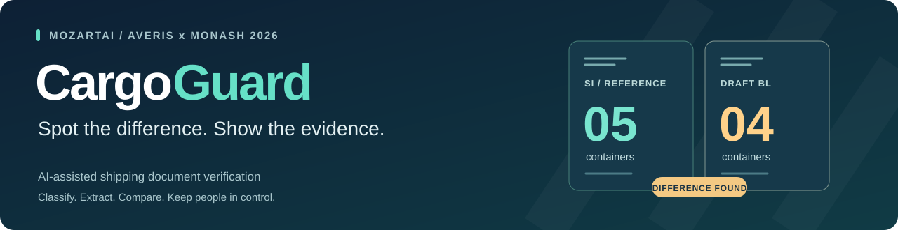

<p align="center">
  <a href="https://cargoguard-averis.onrender.com/"><strong>Live&nbsp;demo&nbsp;↗</strong></a>
  &nbsp; · &nbsp;
  <a href="docs/REVIEW_WORKSPACE_V32.md">User&nbsp;guide</a>
  &nbsp; · &nbsp;
  <a href="docs/ARCHITECTURE.md">Architecture</a>
  &nbsp; · &nbsp;
  <a href="docs/SUBMISSION_CHECK.md">Test&nbsp;report</a>
</p>

## Five containers. Or four?

The Shipping Instruction (SI) says **five**. The draft Bill of Lading (BL) says **four**.

CargoGuard helps Averis shipping staff see **what differs, where the evidence is, and what to do next**—without treating missing information as a successful check.

**Classify the email → Extract seven fields → Compare against the SI → Review with evidence**

Five email categories. TXT, PDF, Word (.docx) and Excel (.xlsx) inputs. Missing or unreadable documents stay incomplete for human review.

## Three features worth trying

| Choose the right draft | Preview before saving | Ask with evidence |
| --- | --- | --- |
| Select the SI and draft to check. Other attachments stay clearly marked **not verified**. | See how one edit affects linked fields, such as “same as consignee.” Save only after checking the source. | Ask about the selected case, inspect cited sources and prepare a follow-up. The assistant **cannot change the saved decision**. |

Earlier results and original files remain available in **History**. Correction drafts are never sent automatically.

## Try the prototype

1. **Open the demo → Run inbox.** No account or personal API key needed.
2. **Find `email_313`.** See five versus four containers and a **500 kg** weight difference. Open a source reference to check the evidence.
3. **Open Ask CargoGuard** and attach that case. Ask: *“What needs fixing, and what should I do next?”* Review the outgoing data and consent before sending.
4. **Inspect `email_512` and `email_507`.** A scan needing review and a missing draft stay incomplete, with a next step.

For multi-file selection, correction previews and history, see the [user guide](docs/REVIEW_WORKSPACE_V32.md). The [synthetic intake fixtures](tests/fixtures/intake) provide a reproducible example.

> Free hosting may take around a minute to wake. Use only organiser/synthetic data. AI has shared limits; core comparison and manual review still work without it.

## Evidence, not just a demo

| **520 / 520** | **350 passed** | **228 passed** |
| :---: | :---: | :---: |
| Supplied-data outputs matched | Unit tests · zero skipped | Local HTTP checks |

**Verified 22 September 2026.** Production build and clean installation also passed. The 520-email result uses supplied **development data**, not an unseen test set or a claim of production accuracy. [See scope, results and limitations →](docs/SUBMISSION_CHECK.md)

## How it is built

**React / Next.js · Node.js on Render · Turso / libSQL · OpenAI · Tesseract.js**

A trained **TF-IDF logistic model** routes emails; deterministic checks compare shipment fields. Render runs the pipeline, and Turso stores cases, small originals and review history. Optional OpenAI assistance uses server-side credentials and explicit consent. Browser-local OCR proposes text for human confirmation.

[Architecture & implementation](docs/ARCHITECTURE.md) · [Model & AI evidence](docs/MODEL_CARD.md) · [Requirements coverage](docs/REQUIREMENTS.md)

## Required written responses

<details>
<summary><strong>Open the six submission answers</strong> — problem, AI, testing, challenges, metrics and roadmap</summary>

### 1. Problem-solution alignment

Shipping staff need precise SI-to-draft comparisons. CargoGuard routes five email types and checks seven fields: shipper, consignee, notify party, loading port, discharge port, container count and gross weight. Uncertain evidence goes to a person.

### 2. AI and cloud infrastructure integration

Learned routing is part of the core workflow. Render performs processing; Turso persists reviews. Optional consented OpenAI supports source-quoted recovery and case chat. Exact comparison does not depend on an LLM.

### 3. User feedback/testing

Automated tests, organiser inputs, synthetic challenges and laptop walkthroughs informed improvements. **No Averis employee usability study or measured time-saving claim** is presented. Those need a supervised pilot.

### 4. Coding challenges

Ambiguous attachments led to explicit pair selection. Linked fields led to shared preview/save logic. Database outages led to separate process and storage checks. LLM proposals require source validation and human confirmation.

### 5. Success metrics

The dated checks above establish supplied-data agreement and tested software behaviour. Proposed business measures are review time, missed differences, correction rounds and staff task completion—not invented ROI.

### 6. Scalability plans / future roadmap

**Next:** an approved non-confidential pilot. **Before confidential use:** corporate identity, access controls and retention safeguards. **At larger scale:** queued workers, managed file storage and load testing. Mailbox/ERP integrations remain future work.

[Read the detailed written responses and supporting evidence →](docs/WRITTEN_RESPONSES.md)

</details>

## Run it yourself

Requires **Node.js ≥22.13**, npm and Git. The core app needs no OpenAI key.

<details>
<summary><strong>Windows PowerShell</strong></summary>

```powershell
git clone https://github.com/Priscilla0117/CargoGuard.git
cd CargoGuard
npm ci
$env:CARGO_LOCAL_DB='work/local.db'
New-Item -ItemType Directory -Force work
npm run db:migrate
node scripts/stage-ocr.mjs
npm run dev
```

Open **http://localhost:3000**, then choose **Run inbox**. Keep the environment variable in the server's terminal.

</details>

<details>
<summary><strong>macOS / Linux</strong></summary>

```sh
git clone https://github.com/Priscilla0117/CargoGuard.git
cd CargoGuard
npm ci
export CARGO_LOCAL_DB=work/local.db
mkdir -p work
npm run db:migrate
node scripts/stage-ocr.mjs
npm run dev
```

Open **http://localhost:3000**, then choose **Run inbox**. SQLite is for local development; the hosted app uses Turso.

</details>

[Testing & operating limits](docs/DEVELOPMENT.md) · [Cloud deployment](docs/DEPLOYMENT.md) · [Environment template](.env.example)

---

**Demo boundaries:** browser workspaces are not corporate authentication. A match is not shipment approval. OCR/AI can be wrong; inspect sources before confirming.

**Technical documentation:** [written responses](docs/WRITTEN_RESPONSES.md) · [verification report](docs/SUBMISSION_CHECK.md) · [cloud and AI validation](docs/CLOUD_RELEASE.md).

**Acknowledgements:** built with open-source dependencies and OpenAI Codex assistance. Organiser inputs are included for the authorised demo; answer keys are not runtime inputs or published here. Preserve vendor/OCR licences. The team must confirm eligibility, originality, permitted dates and any reused material.
